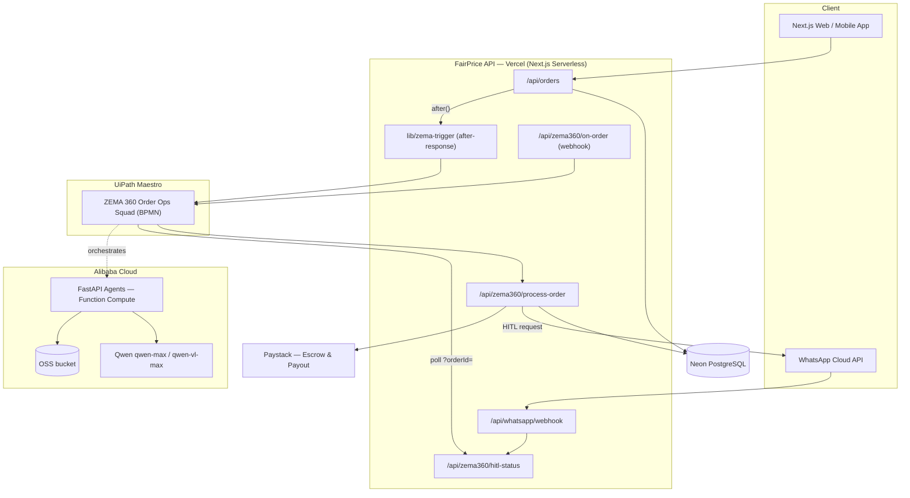
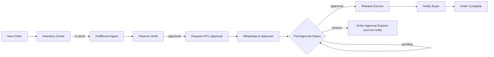

# FairPrice.ng — The Transactional OS for Africa's Informal Economy

[](https://fairprice.ng)
[](https://prisma.io)
[](https://developers.facebook.com/docs/whatsapp/cloud-api)
[](https://fairprice.ng)
[](LICENSE)

FairPrice.ng is an AI-powered, escrow-based marketplace designed to solve trust and pricing issues in Nigeria's informal economy. It connects buyers with verified sellers through a secure conversational commerce layer, enabling price negotiations and "headless" ordering directly via WhatsApp — with an autonomous multi-agent commerce OS (ZEMA 360) powered by Alibaba Qwen running behind the scenes.

---

## Project Description

Africa's informal economy — over 80% of Nigeria's retail commerce — runs on trust, haggling, and personal relationships. Buyers routinely overpay because prices are opaque. Sellers lose money because payment arrives after delivery. Disputes are resolved by reputation, not contract. No technology has bridged this gap at scale.

**ZEMA 360** is an autonomous multi-agent AI system embedded in FairPrice.ng that replaces manual coordination with intelligent automation:

- A **Sales Agent** evaluates order intent and routes to the best-matched verified seller
- An **Inventory Agent** checks real-time stock availability and triggers restocking signals
- A **Finance Agent** verifies escrow balance and calculates the correct payout amount
- A **UiPath Maestro BPMN** orchestrates the entire squad in strict sequence — no step runs out of order
- A **Human-in-the-Loop gate** sends a WhatsApp message to the designated approver before any funds move; escrow only releases after an explicit `approve RUN-XXXX` reply

The result: a buyer places an order on WhatsApp or the web → ZEMA 360 processes it autonomously → the human approver confirms on WhatsApp → Paystack releases escrow funds to the seller. End-to-end commerce automation with human oversight exactly where it matters.

---

## UiPath Components Used

| Component | Role in ZEMA 360 |
|---|---|
| **UiPath Maestro** | BPMN process orchestrator — sequences the agent squad (Inventory Check → Fulfillment → Finance Verify → HITL Approval → Escrow Release → Buyer Notification) |
| **API Workflows** | HTTP connectors calling FairPrice.ng REST endpoints: `/api/zema360/on-order`, `/api/zema360/process-order`, `/api/zema360/hitl-status`, `/api/escrow/release`, `/api/paystack/payout`, `/api/whatsapp/send` |
| **Human Task (HITL)** | Approval gate node — sends a structured WhatsApp message to the human approver; the Maestro BPMN polls `/api/zema360/hitl-status?orderId=` until it receives `approved` or hits the timeout threshold |
| **Coded Agents** | Python FastAPI agents (Sales, Inventory, Finance) deployed on Alibaba Function Compute; powered by Qwen `qwen-max`; invoked by Maestro via API Workflow calls to the agent orchestrator |

### Agent Type

> **Both Coded Agents and Low-code orchestration are used.**
>
> - **Coded Agents** — Python (Sales Agent, Inventory Agent, Finance Agent) on Alibaba Function Compute, calling Qwen `qwen-max` via Alibaba DashScope
> - **Low-code Orchestration** — UiPath Maestro BPMN with API Workflow connectors and a Human Task node managing the approval gate

---

## Setup Instructions for Judges

> These steps let you trigger the ZEMA 360 pipeline and observe the full end-to-end flow: order placed → agents process → WhatsApp HITL sent → escrow released.

### Option A — Live Demo (Recommended)

The system is deployed and running at **[fairprice.ng](https://fairprice.ng)**. No local setup required.

1. Open [fairprice.ng](https://fairprice.ng) and create a free buyer account (or contact via DevPost for judge credentials)
2. Browse any product and place an order
3. ZEMA 360 activates automatically — the `after()` hook on `/api/orders` triggers the Maestro BPMN
4. View the live agent dashboard at [fairprice.ng/zema360](https://fairprice.ng/zema360) (requires admin login)
5. The human approver receives a WhatsApp message; reply `approve RUN-XXXX` to release escrow and complete the order

**WhatsApp approver number:** +2348162816305

To observe the HITL API directly:
```
GET https://fairprice.ng/api/zema360/hitl-status?orderId=<orderId>
```

### Option B — Local Setup

**Prerequisites:**
- Node.js 18+, Python 3.11+
- Neon PostgreSQL (free tier sufficient) or any Postgres instance
- Alibaba Cloud DashScope API key (for Qwen)
- Paystack test-mode account
- Meta WhatsApp Business API credentials

**Step 1 — Clone and configure frontend:**
```bash
git clone https://github.com/saintzema/ratel-shop.git
cd ratel-shop/frontend
npm install
cp .env.example .env.local
# Required variables:
#   DATABASE_URL          — Neon or local Postgres connection string
#   DASHSCOPE_API_KEY     — Alibaba DashScope key for Qwen
#   WHATSAPP_ACCESS_TOKEN — Meta Cloud API token
#   WHATSAPP_PHONE_NUMBER_ID
#   PAYSTACK_SECRET_KEY   — Paystack secret (test mode)
#   NEXTAUTH_SECRET       — Random string for session signing
npx prisma db push
npm run dev   # → http://localhost:3000
```

**Step 2 — Start the ZEMA 360 agent backend:**
```bash
cd ../backend
pip install -r requirements.txt
cp .env.example .env
# Required variables:
#   DASHSCOPE_API_KEY
#   FAIRPRICE_API_URL=http://localhost:3000
#   FAIRPRICE_API_KEY   — any secret string (must match ZEMA_API_KEY in frontend .env.local)
uvicorn app.main:app --reload --port 8000
```

**Step 3 — Configure UiPath Maestro:**
- Import the BPMN process from `uipath/ZEMA360-OrderOpsSquad.xaml`
- Set the on-order webhook URL: `http://localhost:3000/api/zema360/on-order`
- Set the agent endpoint: `http://localhost:8000/api/process`
- Set the HITL poll endpoint: `http://localhost:3000/api/zema360/hitl-status`

**Step 4 — Trigger a test order:**
```bash
curl -X POST http://localhost:3000/api/zema360/on-order \
  -H "Content-Type: application/json" \
  -H "x-api-key: <ZEMA_API_KEY>" \
  -d '{"orderId":"test-001","amount":50000,"sellerId":"seller-001","buyerPhone":"+2348000000000"}'
```

Watch the Maestro BPMN execute the agent squad, then check WhatsApp for the HITL approval request.

---

## Architecture



### ZEMA 360 Order Pipeline (UiPath Maestro BPMN)

When an order is placed, the FairPrice API auto-triggers the BPMN (`after()` on `/api/orders`, or via the `/api/zema360/on-order` webhook). The multi-agent squad runs the order end-to-end with a human-in-the-loop checkpoint before any funds move:



The approver replies `approve RUN-XXXX` (a short, human-typable handle) on WhatsApp; the inbound webhook resolves it and the BPMN polls `hitl-status` by `orderId` until the decision lands. On timeout, escrow stays held for manual review — no funds move without a human.

---

## Key Features

### 1. Trusted Marketplace
- **Escrow System:** Funds are held securely and only released to sellers upon buyer confirmation.
- **Price Intelligence:** AI engine analyzes local and global market data to flag overpriced items and guarantee fairness.
- **Dynamic Negotiations:** Real-time price haggling between buyers and sellers with WhatsApp synchronization.

### 2. WhatsApp "Headless" Ordering
- **Conversational Commerce:** Full ordering flow inside WhatsApp. Customers browse, search, negotiate, and checkout without leaving the app.
- **Intelligent Bot:** Automated product search and rich product cards delivered via Meta Cloud API CTA buttons (opens in-app, not external browser).
- **Bulk Marketing:** Admin-led broadcasts and product promos to targeted WhatsApp audiences.
- **WhatsApp Listing:** Sellers can create product listings end-to-end via WhatsApp chat.

### 3. ZEMA 360 — Autonomous Commerce OS (Qwen-Powered)
- **Multi-Agent Ops Squad:** Sales, Inventory, and Finance agents collaborate to process orders end-to-end.
- **Human-in-the-Loop:** Every critical financial action (escrow release, Paystack payout) requires WhatsApp approval from the designated approver.
- **MCP Tool Integration:** Agents call real FairPrice operations (orders, escrow, payouts, WhatsApp notifications) via a Model Context Protocol server.
- **Multimodal Ingestion:** Qwen-VL processes seller-uploaded photos and KYC documents into structured listings.
- **Alibaba Cloud Deployment:** Agent orchestrator runs on Alibaba Function Compute with OSS for document storage.

### 4. Seller Empowerment
- **Verified Status:** KYC-backed seller profiles (CAC certificate, Government ID) to build buyer trust.
- **Negotiation Dashboard:** Specialized UI for sellers to manage active price offers simultaneously.
- **Payout Management:** Automated settlement via Paystack Transfers with escrow protection.
- **Subscription Tiers:** Starter, Growth, and Scale plans with Paystack subscription integration.

### 5. Admin Command Center
- **360° User Management:** View sellers and buyers, approve KYC, manage subscriptions, resolve disputes.
- **AI Provider Toggle:** Switch Ziva's brain between Qwen (qwen-max) and Gemini (gemini-2.5-flash) at runtime — no redeploy needed.
- **Real-Time Sync:** Live order, negotiation, and dispute feeds across the admin dashboard.
- **WhatsApp Bulk Import:** Upload unstructured data to bulk-import WhatsApp contacts to the user database.

---

## Technical Stack

| Layer | Technology |
|---|---|
| Frontend | Next.js 15 (App Router), Tailwind CSS, Framer Motion, shadcn/ui |
| API | Next.js Serverless Functions on Vercel |
| Database | Neon PostgreSQL + Prisma ORM |
| Auth | NextAuth.js (email/password + role-based access) |
| AI — Ziva assistant | Qwen qwen-max via Alibaba DashScope (Gemini fallback) |
| AI — ZEMA 360 agents | Qwen qwen-max + qwen-vl-max via Alibaba MaaS |
| Agent runtime | FastAPI on Alibaba Function Compute |
| Agent storage | Alibaba OSS (`fairprice-zema` bucket) |
| WhatsApp | Meta Cloud API v25.0 |
| Email | Resend |
| Payments | Paystack (checkout + payouts + subscriptions) |
| Escrow | Custom EscrowService with automatic release cron |

---

## Project Structure

```
├── frontend/          # Next.js web app, API routes, Prisma schema
│   ├── src/app/       # App Router pages and API handlers
│   ├── src/lib/       # WhatsApp, Escrow, Payout, Qwen services
│   └── prisma/        # Database schema
├── backend/           # FastAPI ZEMA 360 agent orchestrator
│   └── app/zema/      # Qwen agents, MCP server, OSS client
└── mobile/            # Capacitor mobile app (iOS/Android)
```

---

## Getting Started

### Prerequisites
- Node.js 18+
- Neon PostgreSQL database (or any Postgres)
- Meta Developer Account (WhatsApp Cloud API)
- Alibaba Cloud account (DashScope API key for Qwen)
- Paystack account

### Installation

```bash
# Clone
git clone https://github.com/saintzema/ratel-shop.git
cd ratel-shop

# Frontend
cd frontend
npm install
cp .env.example .env.local   # fill in your credentials
npx prisma db push           # sync schema to your DB
npm run dev
```

```bash
# Backend (ZEMA 360 agents)
cd backend
pip install -r requirements.txt
cp .env.example .env
uvicorn app.main:app --reload
```

### Key Environment Variables

See [`frontend/.env.example`](frontend/.env.example) and [`backend/.env.example`](backend/.env.example) for the full list. Critical ones:

- `DATABASE_URL` — Neon PostgreSQL connection string
- `DASHSCOPE_API_KEY` — Alibaba DashScope key for Qwen
- `WHATSAPP_ACCESS_TOKEN`, `WHATSAPP_PHONE_NUMBER_ID` — Meta Cloud API
- `PAYSTACK_SECRET_KEY` — Paystack payments
- `NEXTAUTH_SECRET` — NextAuth session signing

---

## License

[MIT](LICENSE) © 2026 Emmanuel Ezeji / ZEMA Technologies

---

---

## 🤖 Built with Claude Code

This entire project — FairPrice.ng and the ZEMA 360 Autonomous Commerce OS — was designed,
implemented, and debugged using **[Claude Code](https://claude.ai/code)** by Anthropic.

### By the numbers

| Metric | Value |
|---|---|
| Total Claude Code tool calls | **8,228** |
| File edits | **442** |
| Shell / Bash commands run | **1,577** |
| New files written | **76** |
| Unique source files modified | **100+** |

### What Claude Code did

- **Architecture** — Proposed the UiPath Maestro + Qwen + WhatsApp HITL architecture from scratch
- **Agent backend** — Wrote all ZEMA 360 agents (`orchestrator.py`, `agents.py`, `mcp_server.py`, `memory.py`) on Alibaba Function Compute
- **API routes** — Implemented every Next.js serverless endpoint (`/api/zema360/*`, `/api/escrow/*`, `/api/payouts/*`, `/api/whatsapp/*`)
- **Database schema** — Designed and iterated the full Prisma schema across 15+ migrations
- **TypeScript safety** — Ran `npx tsc --noEmit` after every change; zero type errors in production
- **Debugging** — Resolved Alibaba FC cold-start timeouts, Qwen tool-call format differences, WhatsApp webhook signature validation, Paystack transfer edge cases
- **UiPath integration** — Wired the BPMN trigger (`after()` on `/api/orders`), HITL polling loop, and approval webhook

### Session logs

Full build evidence (session stats, file lists, key commands) is in [`claude-code-logs/`](claude-code-logs/).

---

Developed by **[Zema Technologies Group](https://zemaai.com)** — making commerce work for everyone.
