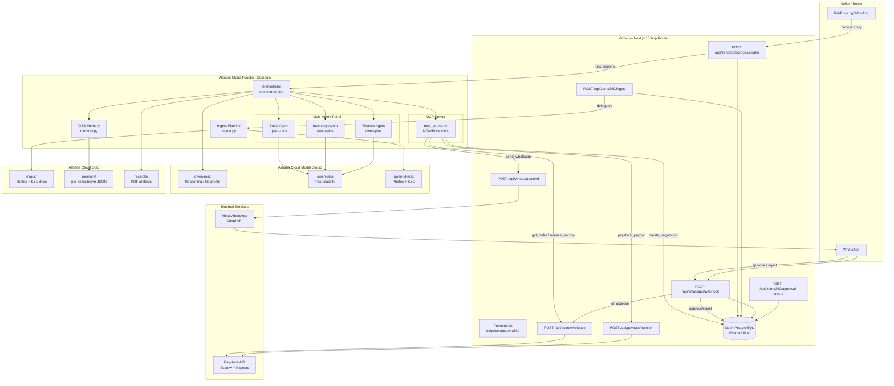

# ZEMA 360 — System Architecture

> Qwen-powered autonomous commerce OS for FairPrice.ng  
> Hackathon: Global AI Hackathon with Qwen Cloud | Track 4: Autopilot Agent

## High-level Architecture



## Component Descriptions

### Vercel Layer (Next.js 15)

| Route | Purpose |
|---|---|
| `POST /api/zema360/process-order` | Enterprise entry point — triggers the full multi-agent pipeline for a given order/deal. Bearer ApiKey auth (Scale tier). |
| `POST /api/zema360/ingest` | Delegating router for multimodal ingest — forwards to FC backend. |
| `GET /api/zema360/approval-status` | Polling endpoint — Python orchestrator polls until HITL status resolves. |
| `POST /api/whatsapp/webhook` | Inbound WhatsApp handler — parses `approve <id>` / `reject <id>` from approver number. |
| `POST /api/escrow/release` | Service-token-guarded escrow release via Paystack. |
| `POST /api/payouts/transfer` | Initiates seller payout via Paystack Transfer API. |
| `POST /api/whatsapp/send` | Outbound WhatsApp — sends interactive approval prompts. |

### Alibaba Cloud Function Compute Layer

| Module | Purpose |
|---|---|
| `orchestrator.py` | Stateless pipeline driver: INGEST → ASSESS → NEGOTIATE → AWAITING_APPROVAL → EXECUTE → DONE |
| `ingest.py` | Qwen-VL multimodal pipeline: photos + KYC → structured listing JSON + OSS artifacts |
| `agents.py` | Sales / Inventory / Finance agent classes. Each evaluates a deal and returns a `Position`. |
| `mcp_server.py` | MCP server exposing 8 FairPrice store tools over stdio — callable by any MCP client. |
| `memory.py` | OSS-backed per-entity memory (seller/buyer deal history, risk aggregates, bounded to last 50 events). |
| `qwen_client.py` | Async Qwen HTTP client with exponential backoff (4 retries), JSON extraction, vision_json. |
| `oss_client.py` | Alibaba OSS wrapper: `put_bytes`, `get_bytes`, `signed_url`. |

### Alibaba Cloud Model Usage

| Model | Used for |
|---|---|
| `qwen-vl-max` | Photo → structured listing extraction; KYC document parsing + name-match verification |
| `qwen-max` | Complex reasoning: deal risk scoring, price intelligence, negotiation orchestration |
| `qwen-plus` | Per-agent evaluation (Sales / Inventory / Finance) — fast, cost-efficient classification |

### Human-in-the-Loop (HITL) Flow

```
New Order
   │
   ▼
process-order → 3-agent panel (qwen-plus each)
   │
   ├─ Finance risk ≥ 60 OR any veto?
   │        │ YES
   │        ▼
   │   ZemaApprovalRequest persisted to DB
   │        │
   │        ▼
   │   WhatsApp sent to +2348162816305
   │        "approve <id>"  /  "reject <id>"
   │        │
   │        ▼
   │   Approver replies → webhook handler
   │        │ approve        │ reject
   │        ▼                ▼
   │   escrow release    notification
   │   Paystack payout   to seller
   │
   └─ Auto-approve (low risk)
           │
           ▼
      escrow release + payout (no human needed)
```

### Data Flow: Multimodal Ingest

```
Seller sends photos (WhatsApp/upload)
          │
          ▼
    image_urls + kyc_urls
          │
          ▼
  ingest.run_ingest()
  ┌──────────────────────────────────────┐
  │  qwen-vl-max (per image, parallel)   │
  │  → title, category, price_ngn,       │
  │    condition, quantity, description  │
  │    tags, confidence                  │
  ├──────────────────────────────────────┤
  │  qwen-vl-max (per KYC doc, parallel) │
  │  → doc_type, name, id_number,        │
  │    expiry, matches_seller,           │
  │    confidence                        │
  └──────────────────────────────────────┘
          │
          ▼
  Upload artifacts → OSS bucket fairprice-zema
  ingest/<seller_id>/<run_id>/photo_00.jpg
  ingest/<seller_id>/<run_id>/kyc_00.jpg
  ingest/<seller_id>/<run_id>/manifest.json
          │
          ▼
  IngestResult → orchestrator.state.listing
```

## Security Model

- **ZEMA_SERVICE_TOKEN**: Bearer auth for all inter-service calls (FC → Next.js API routes). Never exposed client-side.
- **ApiKey model**: Scale-tier sellers get an API key (Prisma `ApiKey`) for enterprise access to `process-order` and `ingest` endpoints. Rate-limited, expiry-aware.
- **OSS bucket `fairprice-zema`**: private, no public access. Files served only via `oss_client.signed_url()` (pre-signed, TTL 1 hour).
- **WhatsApp HITL**: inbound approval restricted to `ZEMA_APPROVER_WHATSAPP` number; all other senders are ignored.
- **Secrets**: never committed to git. Managed via Vercel environment variables (frontend) and Serverless Devs `s.yaml` env references (backend).
